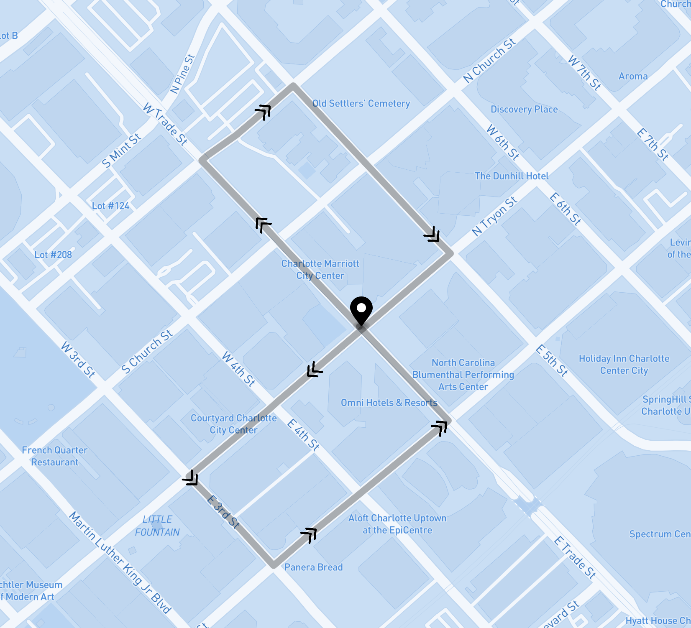

# Mapping API Demo Project

## Fleurix Conference March 2021

### Developed & presented by Halley Cummings

This is a small demo project utilizing functionality from [OSRM](http://project-osrm.org/) and [Mapbox](https://www.mapbox.com) to generate a short random walking path giving a starting location and target length.

## To run locally

You will need to create a Mapbox account on their free tier and get an access token. Add this access token to `js/generate-route.js`. Then, you should be able to open `index.html` in a browser and click "Generate path" to see the program in action.

## Resources

I'd highly recommend checking out these resources for more information on OSRM & Mapbox and for some great quickstart materials!

- [OSRM quickstart docker image](https://hub.docker.com/r/osrm/osrm-backend)
- [OSRM demo server](https://github.com/Project-OSRM/osrm-backend/wiki/Demo-server)
- [OSRM API documentation](http://project-osrm.org/docs/v5.5.1/api/#general-options)
- [OpenStreetMap](https://www.openstreetmap.org/#map=5/37.996/-95.845)
- [Mapbox GL JS Quickstart](https://docs.mapbox.com/mapbox-gl-js/api/#quickstart)
- [Rendering a line using Mapbox](https://docs.mapbox.com/mapbox-gl-js/example/geojson-line/)
